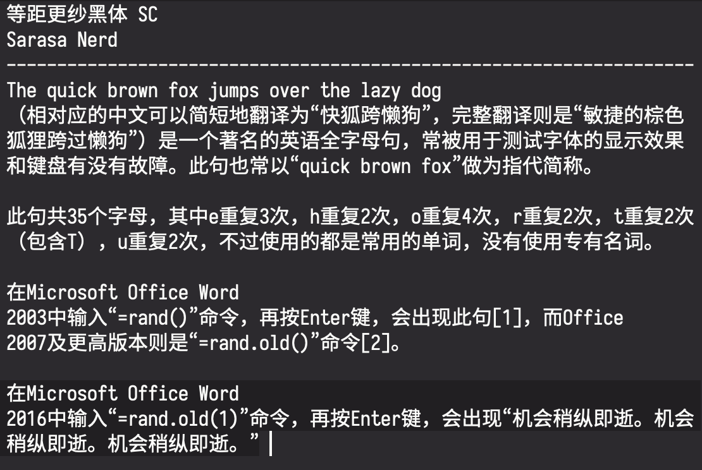
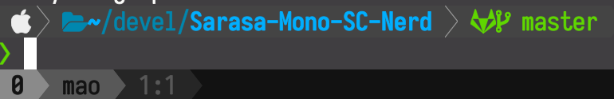

S 改 T

## 关于

[Sarasa Mono TC](https://github.com/be5invis/Sarasa-Gothic)字體打了 [Nerd fonts](https://github.com/ryanoasis/nerd-fonts)補丁。

文字效果如下(沒改T)：

圖示效果如下(沒改T)：

## 安装
MacOS 使用者不可以直接透過cask安裝：

## 使用
在你的主題設定檔文件中，使用 `Sarasa Mono TC Nerd`。

## 說明
- `等距更紗黑體 TC` 是極少數做到中文和英文2:1嚴格對齊的字體，適合用來寫程式碼, 以及 org mode 裡中英文混合的表格對齊等。
- `Nerd fonts` 提供了很多圖示字體，特別適合各種Shell/NeoVim/Emacs主題，例如 zsh 的
  [`p10k`](https://github.com/romkatv/powerlevel10k), 
  [`Powerline`](https://github.com/powerline/powerline) 等等。
- 本項目將 `Nerd fonts` 打補丁到 `等距更紗黑體 TC` 中，但並沒有選擇全部 `Nerd fonts` 圖示集，而是將 `material design` 剔除，原因是：
  - 這個圖示集很大，和很多漢字衝突，連 `不` 字都不能正常顯示。
  - 在寫程式碼這個使用場景中，這個圖示集沒什麼用。
- 本項目對圖示字體的長寬進行了調整，使之完美符合2:1，不會出現高度不對齊的問題。
- 本項目對字體在`Chinese (Taiwan)`和`English (US)`下的`Family`, `SubFamily`和`UniqueID`等多個屬性進行了設定，避免了很多問題。

## 基於其它 Sarasa 字體

1. 進入 `nerd font` 原始碼目錄，將本項目 *scripts* 目錄下的文件複製過去。
2. `git checkout <commit-id>` 其中的 `commit-id` 來自於
   *nerd-font-commit.txt*
3. 執行 *./patch.sh*
4. 修改 *font-patcher* 文件中 `Mono TC` (約第87行)
5. 把 *./generate.sh* 中的字體路徑改好，然後執行
